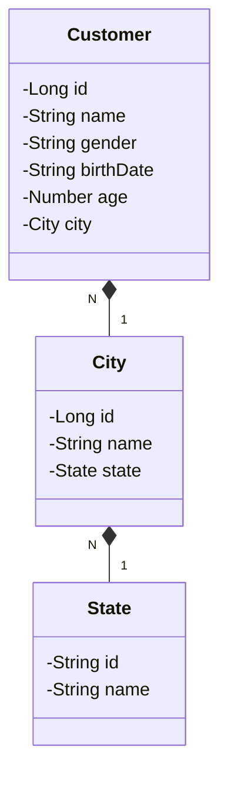

## Desafio API REST

### Requisitos do projeto:

Criar uma API REST com as seguintes funcionalidades:

`cadastro de cidades`
- Cadastrar cidade
- Consultar cidade pelo nome
- Consultar cidade pelo estado

`cadastro de clientes`
- Cadastrar cliente
- Consultar cliente pelo nome
- Consultar cliente pelo Id
- Remover cliente
- Alterar o nome do cliente

Considere o cadastro com dados básicos:
Cidades: nome e estado
Cliente: nome completo, sexo, data de nascimento, idade e cidade onde mora

A partir dos dados básicos, foi criado o seguinte diagrama de classes:

### Tecnologias utilizadas:

- Spring Boot
- Spring Web
- Spring Data Jpa
- Postgresql
- Lombok
- Docker