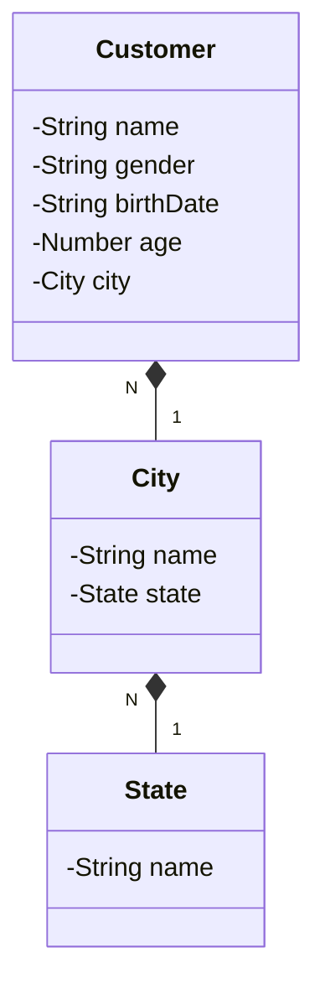

## Desafio API REST

### Tecnologias utilizadas:

[![Java-Version][java-image]][java-url]
[![Spring Version][spring-image]][spring-url]
[![Spring Data][spring-data-image]][spring-data-url]
[![Spring Web][spring-web-image]][spring-web-url]
[![Postgres-Version][postgres-image]][postgres-url]
![Swagger-Version][swagger-image]

---

### Requisitos do projeto:

Criar uma API REST com as seguintes funcionalidades:

`cadastro de cidades`
- Cadastrar cidade
- Consultar cidade pelo nome
- Consultar cidade pelo estado

`cadastro de clientes`
- Cadastrar cliente
- Consultar cliente pelo nome
- Consultar cliente pelo Id
- Remover cliente
- Alterar o nome do cliente

Considere o cadastro com dados básicos:
Cidades: nome e estado
Cliente: nome completo, sexo, data de nascimento, idade e cidade onde 

---
### Como executar o projeto ?

#### Para executar o projeto é necessário ter o Docker instalado e realizar os seguintes passos:


> 1 - Acessar o diretório do projeto

> 2 - Excutar o comando:

```
docker-compose up -d --build
```

O docker irá fazer o build das imagens do banco de dados postgres, do backend java/spring e do frontend vue.js e executá-las em contêineres orquestrados via docker-compose. Agora você já pode fazer chamadas às APIs e consultar a documentação via swagger. Para isso, acesso no navegador o seguinte endereço:

```
http://localhost:8080/swagger-ui/index.html
```

> 3 - Para abrir a aplicação frontend, execute no navegador:

```
http://localhost:5173
```

> 4 - A aplicação será exibida na tela

---

### Digrama de classes

A partir dos dados básicos, foi criado o seguinte diagrama de classes:


### Próximas atividades: 

[X] - Criar testes de unidade <br>
[ ] - Evoluir Arquitetura <br>
[X] - Conteinerizar a aplicação <br>
[ ] - Evoluir a aplicação frontend <br>


[java-image]: https://img.shields.io/badge/microsoft_jdk-17.0.11-red
[java-url]: https://learn.microsoft.com/pt-br/java/openjdk/download
[spring-image]: https://img.shields.io/badge/spring_boot-3.2.5-green
[spring-url]: https://github.com/spring-projects/spring-boot/releases/tag/v3.2.5
[spring-data-image]: https://img.shields.io/badge/spring_data_jpa-3.2.5-green
[spring-data-url]: https://spring.io/projects/spring-data-jpa
[spring-web-image]: https://img.shields.io/badge/spring_web-3.2.5-green
[spring-web-url]: https://docs.spring.io/spring-boot/docs/current/reference/html/web.html
[postgres-image]: https://img.shields.io/badge/postgres-16.1-blue
[postgres-url]: https://www.postgresql.org/about/news/postgresql-161-155-1410-1313-1217-and-1122-released-2749/
[swagger-image]: https://img.shields.io/badge/swagger-2.3.0-purple
